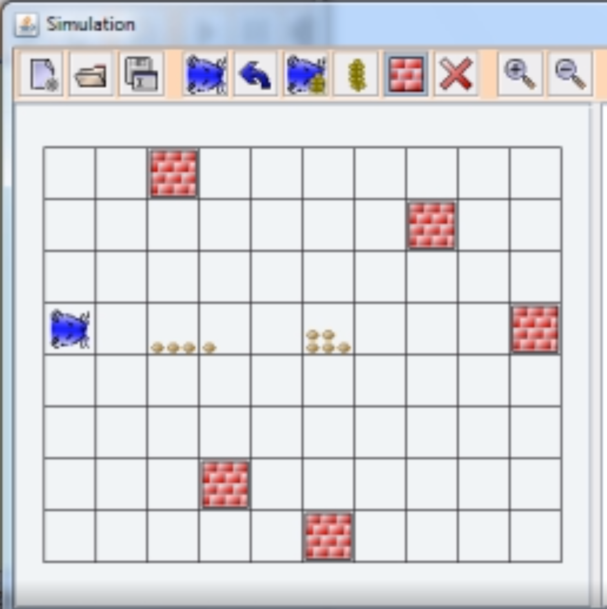

# Hamster simulator

## Background

The hamster simulator is based on a [game developed in Java](https://www.java-hamster-modell.de/simulator.html) with the
same name. It has been developed by students of a German university for other people to learn the basics of Java. With
only a few predefined functions (move, turnLeft, checkIfWallInFront, pickUp, if, for and while) you had to clear the
playing field of all the seeds.

Looking back, it did its job in getting me engaged into programming, but it was too easy.

So this version is not intended as a learning instrument, but as way to challenge yourself and your friends.

## Goals

There are several things you can do, but the one thing they have is common is: Have fun and learn to love logic and
Javascript (hopefully Typescript as well).

1. Create the most difficult mazes and try to solve it yourself or let your friends solve them.
2. Challenge other people to a duel on who can solve a maze the fastest and beat the best time
3. Learn multiple ways to solve problems in a visual appealing way

### -> Still a work in progress
